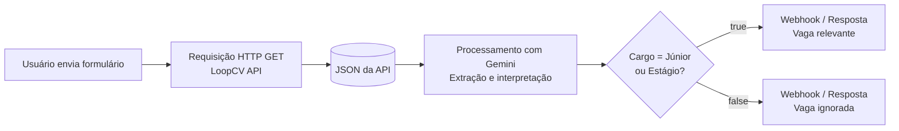

# Caçador de Estágios

## Sobre o Projeto
**Projeto:** Caçador de Estágios
**Problema que resolve:** Dificiculdade de universitários para encontrar estágio

## Integrantes
| Nome | GitHub |
|------|--------|
| Beatriz Caroline Moreno Tavares | Bia-z |
| Cauã Queiroz Guerra | Caua-Guerra |
| Natã de Almeida Santos  | Natan938 |

## Arquitetura

